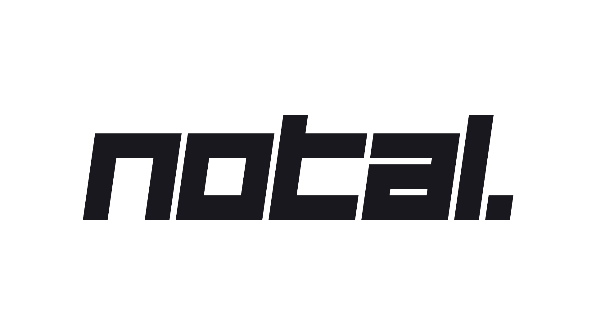

 

# Screenshots

    
    

    
    

## PR's and code reviews are welcome!

### Discover more screenshots on [https://notal.app/workspace/screenshots](https://notal.app/workspace/screenshots)

### TODO: Switch Tooltip to Popper.js, soft delete on card and fields, card editibility, field reorder

# Notal

Notal is a simple platform to keep your project management simple, as well as making it easy to work with multiple users on a workspace together. Currently a workspace consists from 4 main components: Board, Roadmap, Bookmarks and Changelog.

- Use board to keep your to-do lists organized
- Use roadmap to build a simple roadmap for your product. If you share this link with other users, they can upvote roadmaps so you can see which feature your users most wanted (Building - WIP)
- Use bookmarks to link board cards with bookmarks which you can add images and links (Building - WIP)
- Use changelog to view and edit your project's version notes (Building - WIP)

## By sharing workspace URL with someone, you let them:

- Vote for Roadmaps
- See who is working on that workspace
- If you want privacy on workspaces, you can always press `eye` button on workspace sidebar to set that workspace to private
- If someone is added as user in that workspace, they should be able to edit and view the workspace even if that workspace is set to private

## Technical features

- TypeScript as primary programming language
- NextJS + React 18 as primary framework, Vercel as primary host
- Authentication via Google and GitHub
- SWR, PWA, SSR & Workbox ready (see ./notal-ts/worker/index.js for workbox development logs)
- SEO is correctly managed, used Workbox for superfast caching
- Uses Tailwind on frontend for styling, `framer-motion` for cool animations, `next-themes` for Dark theme and `react-beautiful-dnd` for beatiful drag drop experience
- MongoDB & serverless functions on backend
- Secure session management using Firebase Auth
- Custom components made just for Notal, each of them has different purpose and different styles with fully customizable option (NotalUI)
- Comes with Google Material Icons
- Google Analytics for analytics, page views and page view times: LCP, TTFB and FCP

You can see the live demo at **https://notal.app**

## Known issues

- TTFB time as well as FCP time is taking long time
- First load is taking nearly 7~ seconds on benchmarks, need to switch to dynamic imports to reduce JS bundle
- Maybe switch from Framer Motion to pure CSS or Tailwind transitions?

## Running locally in development mode

First of all, you need to create a Firebase project, as well as MongoDB database. If you don't want to create these stuff, you will be able to run the project in Storybook mode in the future to review each component.

- [Create Firebase project from here](https://cloud.google.com/firestore/docs/client/get-firebase)
- [Create MongoDB database from here](https://www.mongodb.com/blog/post/quick-start-nodejs-mongodb-how-to-get-connected-to-your-database)

Then, clone the repository and run `npm install && npm run dev` inside `notal-ts` file:
Make sure to configure the project for your needs from Configuring section

    git clone https://github.com/erenkulaksiz/notal.git
    cd notal/notal-ts
    npm install
    npm run dev

Opens development server on [https://localhost:3000](https://localhost:3000) with hot reload activated

Note: Make sure you have right port on .env.local aswell for API

## Building and deploying in production

If you wanted to run this site in production, you should install modules then build the site with `npm run build` and run it with `npm run start`:

    cd notal-ts
    npm install
    npm run build
    npm run start

You should run `npm run build` again any time you make changes to the site

## Configuring

If you configure a .env.local file (just copy [.env.local.template](https://github.com/erenkulaksiz/notal/blob/master/notal-ts/.env.local.template) over to '.env.local' and fill in the options) you can configure a range of options

Make sure you have done oAuth options from Firebase console to get auth start to work, as well as MongoDB connection

## Analyze bundle

Run `npm run analyze` to view bundle sizes for client and server

## deprecated/notal-old and deprecated/notal-root

./deprecated file contains old versions of Notal. notal-old was built with [NextUI](https://nextui.org/) and lacked many things. I refactored the code then made `notal-root`. Which later on, i refactored code again and switched to `notal-ts` with typescript.
You can use same .env.local file from `notal-ts` to `notal-root & notal-old`, they use same API's

## Mobile Application

Mobile App of Notal is being built under notal/app folder, with React Native

## Devnote

I've seen lately, many projects like:

- [anytype.io](https://anytype.io)
- [discourse.org](https://www.discourse.org)
- [linear.app](https://linear.app)
- [reflect.app](https://reflect.app)
- [height.app](https://height.app)

While first creating this project, i didn't yet knew these projects. When i was this far, i just found out about them. I suggest you to use them instead of Notal since this project is still being built and has bugs.
Even while buying the domain, i didnt knew about them. It was a bit unlucky but, now i have some competition going :)

## Questions & Contact

You can ask whatever you want from erenkulaksz@gmail.com email or you can just contact me

## License

License is on LICENSE file

You may steal code or just take a "peek", but please credit me or this repo if you are doing so. I'm all aware of what can happen, (which happened before) while publishing this project open source.
