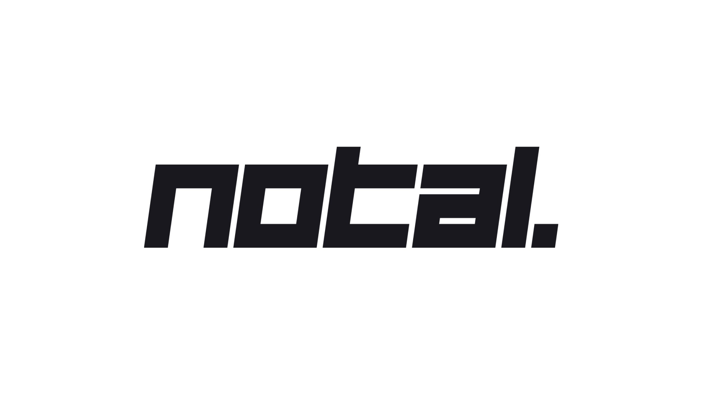

[](https://vercel.com?utm_source=powered-by-vercel)

## You can see the live demo at **https://notal.app**

Notal is a platform to keep your project management simple, as well as making it easy to work with multiple users on a workspace together. Currently a workspace consists from 4 main components: Board, Roadmap, Bookmarks and Changelog.

- Use board to keep your to-do lists organized
- Use roadmap to build a simple roadmap for your product. If you share this link with other users, they can upvote roadmaps so you can see which feature your users most wanted (Building - WIP)
- Use bookmarks to link board cards with bookmarks which you can add images and links (Building - WIP)
- Use changelog to view and edit your project's version notes (Building - WIP)

## Technical features

- TypeScript as language
- NextJS 12.1.6 + React 18 as tech stack, Vercel as host
- Authentication via Google and GitHub using Firebase
- Uses `tailwindcss` on frontend for styling, `framer-motion` for cool animations, `next-themes` for Dark theme and `react-beautiful-dnd` for beatiful drag drop experience
- MongoDB on backend with custom API controller (see [./notal-ts/src/api/controller](https://github.com/erenkulaksiz/Notal/blob/master/notal-ts/src/api/controller/index.ts))
- Introducing NotalUI, each components made custom for just for Notal, which even has Modal and Toast components built-in
- Comes with Google Material Icons
- Google Analytics for analytics, page views and page view times: LCP, TTFB and FCP
- Storybook ready to go for each component, view Storybook section
- Privacy with session checking allows users to create private workspaces

## Running locally in development mode

First of all, you need to create a Firebase project, as well as MongoDB database. If you don't want to create these stuff, you will be able to run the project in Storybook mode in the future to review each component.

- [Create Firebase project from here](https://cloud.google.com/firestore/docs/client/get-firebase)
- [Create MongoDB database from here](https://www.mongodb.com/blog/post/quick-start-nodejs-mongodb-how-to-get-connected-to-your-database)

Then, clone the repository and run `npm install && npm run dev` inside `notal-ts` file:
Make sure to configure the project for your needs from Configuring section

    git clone https://github.com/erenkulaksiz/notal.git
    cd notal/notal-ts
    npm install --force
    npm run dev

Opens development server on [https://localhost:3000](https://localhost:3000) with hot reload activated

Note: Make sure you have right port on .env.local aswell for API

## Building and deploying in production

If you wanted to run this site in production, you should install modules then build the site with `npm run build` and run it with `npm run start`:

    cd notal-ts
    npm install --force
    npm run build
    npm run start

You should run `npm run build` again any time you make changes to the site

## Changelog

[View changelog here](https://notalui.vercel.app/?path=/story/changelog--page)

## Configuring

If you configure a .env.local file (just copy [.env.local.template](https://github.com/erenkulaksiz/notal/blob/master/notal-ts/.env.local.template) over to '.env.local' and fill in the options) you can configure a range of options

Make sure you have done oAuth options from Firebase console to get auth start to work, as well as MongoDB connection

Note: Make sure you enter Google service.json as a single line, and put it inside single quote, like this: GOOGLE_SERVICE='{ type: "...", data: "..." }'

## Analyze bundle

Run `npm run analyze` to view bundle sizes for client and server

## Storybook

[View deployed Storybook here](https://notalui.vercel.app)

Notal introduces Storybook to view each component individually without running the project.

If you installed all dependencies, you can run `npm run sb` in notal-ts folder. Storybook will open the page for you when init is complete.

## Devnote

I've seen lately, many projects like:

- [anytype.io](https://anytype.io)
- [discourse.org](https://www.discourse.org)
- [linear.app](https://linear.app)
- [reflect.app](https://reflect.app)
- [height.app](https://height.app)

While first creating this project, i didn't yet knew these projects. When i was this far making, i just found out about them. I suggest you to use these platforms instead of Notal since this project is still being built and has bugs.

## Questions & Contact

Contact [erenkulaksz@gmail.com](mailto:erenkulaksz@gmail.com)

## tokei
```
===============================================================================
 CSS                     1           39           33            0            6
 JavaScript              4           85           72            3           10
 JSON                    2           61           61            0            0
 SVG                    76          103          103            0            0
 TSX                    79         7619         6968          133          518
 TypeScript            128         3496         2976          198          322
===============================================================================
 Total                 290        11403        10213          334          856
===============================================================================
```